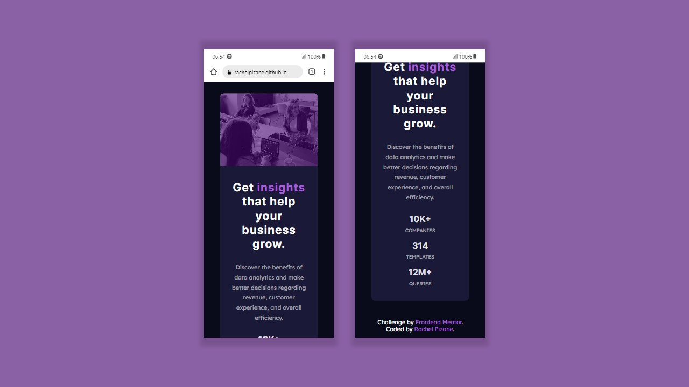

# Stats Preview Card Component | Frontend Mentor 

This is a solution to the [Stats Preview Card Component challenge on Frontend Mentor](https://www.frontendmentor.io/challenges/stats-preview-card-component-8JqbgoU62).

## Overview 🌎

### Screenshot

### Links

- Live Site URL: [GitHub Page - Stats Preview Card Component](https://rachelpizane.github.io/FM04-Stats-Preview-Card-Component/)

## My process 🗺️

### Built with 

- Semantic HTML5 markup;
- CSS custom properties;
- Grid;
- Flexbox;
- Media Queries (Mobile-first).

### What I learned

I'm currently learning about Responsive Web Design and I tried to do this project first for mobile and then for the desktop.
